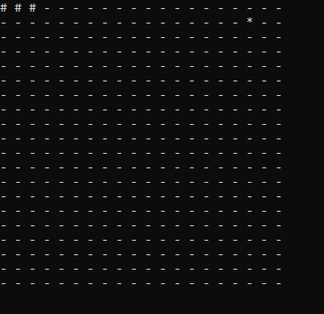

# Snake game

## Навигация

* [Описание проекта](#chapter-0)
* [Интерфейс](#chapter-1)
* [Управление](#chapter-2)
* [Лицензия](#chapter-3)

## Описание проекта

Классическая игра "Змейка"

## Интерфейс

**"-"** - пустая клетка

**"#"** - тело змейки

**"*"** - яблоко

## Управление

**w** - вверх

**a** - влево

**s** - вниз

**d** - вправо

## :open_hands: Лицензия

GNU General Public License v3.0.

Полный текст в [LICENSE](LICENSE)
