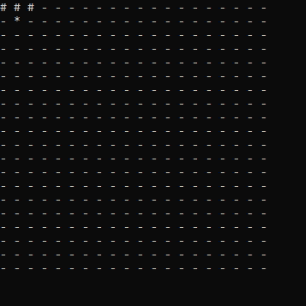

# Snake game

## Навигация

* [Описание проекта](#chapter-0)
* [Как начать](#chapter-1)
* [Интерфейс](#chapter-2)
* [Управление](#chapter-3)
* [Код](#chapter-4)
* [Лицензия](#chapter-5)

<a id="chapter-0"></a>

## Описание проекта

Классическая игра "Змейка".

Игрок управляет длинным, тонким существом, напоминающим змею, которое ползает по плоскости, собирая еду, избегая столкновения с собственным хвостом и краями игрового поля. Каждый раз, когда змея съедает кусок пищи, она становится длиннее, что постепенно усложняет игру. Игра заканчивается, когда голова змейки сталкивается краями игрового поля или с хвостом змейки.

<a id="chapter-1"></a>

## :hammer: Как начать

1. Скачать данный репозиторий
   * Вариант 1
      1. Установить [Git](https://git-scm.com/download/win)
      2. Клонировать репозиторий
      ```bash
      git clone https://github.com/Yu-Leo/snake-game.git
      cd snake-game
      ```
   * Вариант 2 - [Скачать ZIP](https://github.com/Yu-Leo/snake-game/archive/refs/heads/master.zip)

4. Скомпилировать и запустить `./snake-game/main.cpp`

<a id="chapter-2"></a>

## Интерфейс


**"-"** - пустая клетка

**"#"** - тело змейки

**"*"** - яблоко

В случае проигрыша появляется надпись "Game over!" и игра заканчивается.


<a id="chapter-3"></a>

## :video_game: Управление



**w** - вверх

**a** - влево

**s** - вниз

**d** - вправо

<a id="chapter-4"></a>

## :computer: Код

[Техническая документация](./docs/technical-documentation.pdf)


<a id="chapter-5"></a>

## :open_hands: Лицензия

GNU General Public License v3.0.

Полный текст в [LICENSE](LICENSE)
