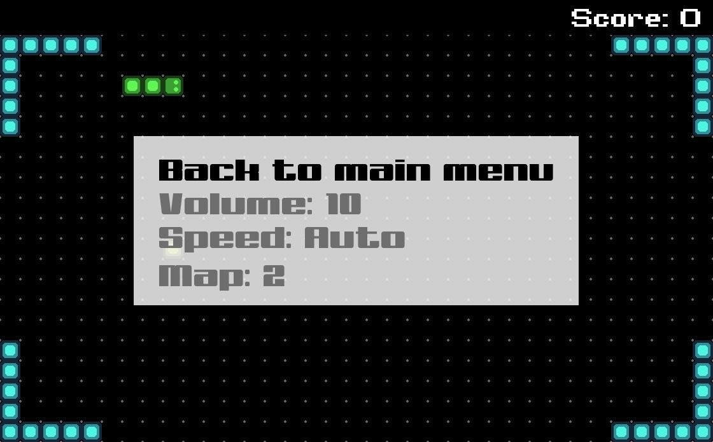
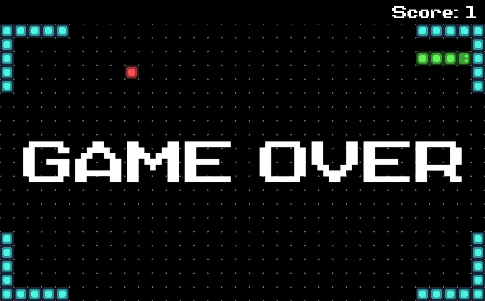

# Snake game

## Навигация

* [Описание проекта](#chapter-0)
* [Как начать](#chapter-1)
* [Интерфейс](#chapter-2)
* [Код](#chapter-3)
* [Лицензия](#chapter-4)

<a id="chapter-0"></a>

## :page_facing_up: Описание проекта

Классическая игра "Змейка".

Игрок управляет длинным, тонким существом, напоминающим змею, которое ползает по плоскости, собирая еду, избегая столкновения с собственным хвостом и краями игрового поля. Каждый раз, когда змея съедает кусок пищи, она становится длиннее, что постепенно усложняет игру. Игра заканчивается, когда голова змейки сталкивается с хвостом змейки.

<a id="chapter-1"></a>

## :hammer: Как начать

1. Установить [Visual Studio 2019](https://visualstudio.microsoft.com/ru/downloads/)
2. Скачать [SFML](https://www.sfml-dev.org/download.php)
3. Скачать данный репозиторий
   * Вариант 1
      1. Установить [Git](https://git-scm.com/download/win)
      2. Клонировать репозиторий
      ```bash
      git clone https://github.com/Yu-Leo/snake-game.git
      cd snake-game
      ```
   * Вариант 2 - [Скачать ZIP](https://github.com/Yu-Leo/snake-game/archive/refs/heads/master.zip)
4. [Подключить SFML к проекту](https://www.sfml-dev.org/tutorials/2.5/start-vc.php)
5. Скомпилировать и запустить `./snake-game/main.cpp`

<a id="chapter-2"></a>

## :camera: Интерфейс

### Меню

Навигация по пунктам меню происходить при помощи стрелок вверх и вниз. Выбор пункта при помощи Enter.

#### :bookmark_tabs: Главное меню


* **Start new game** - начать новую игру.
* **Settings** - переход в меню настроек.
* **Quit** - выход из игры.


#### :bookmark_tabs: Меню паузы


* **Resume new game** - возобновить игру.
* **Settings** - переход в меню настроек.
* **Quit** - выход из игры.


#### :wrench: Меню настроек



* **Back to main menu** - вернуться в главное меню.
* **Volume** - уровень громкости. От 0 до 100. Регулировка происходит при помощи стрелок влево (уменьшить на 5) и вправо (увеличить на 5).

### :video_game: Игровое поле


 - тело змейки

 - яблоко

 - стена


Управление осуществляется при помощи стрелок влево, вверх, вправо, вниз.
При нажатии Escape активируется паузы и открывается меню паузы.

В случае проигрыша выводится надпись "Game over", после чего происходит переход в главное меню игры




<a id="chapter-3"></a>

## :computer: Код

[Техническая документация](./docs/technical-documentation.pdf)

### :file_folder: Папки
**snake-game** - папка проекта с исходным кодом.

**tests** - папка проекта с unit-тестами.

### :wrench: Настройки
```cpp
#define RANDOM_GENERATING false // Генерация яблок в случайных (true) или псевдо-случайных (false) местах
```

При установке `false` стартовое значение для псевдо-случайной генерации задаётся в строчке
```cpp
    srand(0); // Set seed for pseudorandom number generator
```

### :coffee: Тесты

Запуск:


<a id="chapter-4"></a>

## :open_hands: Лицензия
Автор: [Yu-Leo](https://github.com/Yu-Leo)

GNU General Public License v3.0.

Полный текст в [LICENSE](LICENSE)
