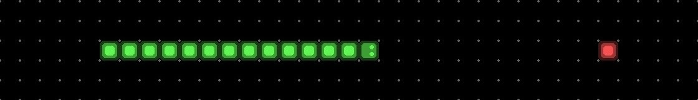
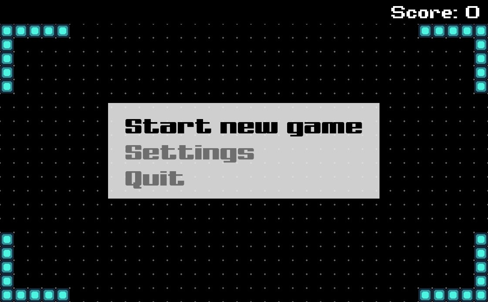
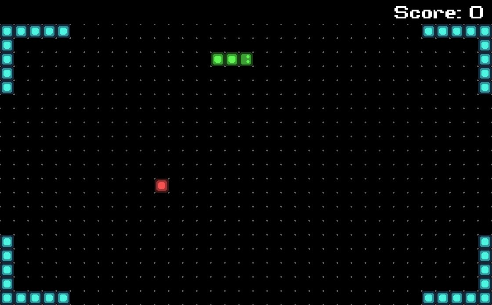

<h1 align="center"> Snake game </h1>

<p align="center">
  <a href="#" target="_blank"> </a>
  <a href="#" target="_blank"> </a>
  <a href="#" target="_blank"> </a>
  <a href="#" target="_blank"> </a>
</p>



## Навигация

* [Описание проекта](#chapter-0)
* [Как начать](#chapter-1)
* [Интерфейс](#chapter-2)
* [Код](#chapter-3)
* [Лицензия](#chapter-4)

<a id="chapter-0"></a>

## :page_facing_up: Описание проекта

Классическая игра "Змейка".


Игрок управляет длинным, тонким существом, напоминающим змею, которое ползает по плоскости, собирая яблоки и избегая столкновения с собственным хвостом и стенами. Каждый раз, когда змейка съедает яблоко, она становится длиннее, что постепенно усложняет игру. Игра заканчивается, когда голова змейки сталкивается с хвостом змейки или врезается в стену.


В игре присутствует 2 вида яблок: красные и желтые. Съедание красного яблока увеличивает длину змейки на одну клетку, а съедание желтого – на две.

<a id="chapter-1"></a>

## :hammer: Как начать

1. Установить [Visual Studio 2019](https://visualstudio.microsoft.com/ru/downloads/)
2. Скачать [SFML](https://www.sfml-dev.org/download.php)
3. Скачать данный репозиторий
   * Вариант 1
      1. Установить [Git](https://git-scm.com/download/win)
      2. Клонировать репозиторий
      ```bash
      git clone https://github.com/Yu-Leo/snake-game.git
      cd snake-game
      ```
   * Вариант 2 - [Скачать ZIP](https://github.com/Yu-Leo/snake-game/archive/refs/heads/main.zip)
4. Подключить SFML к проекту ([мой туториал](https://github.com/Yu-Leo/tutorials-and-config-files/blob/main/SFML-VisualStudio2019/README.md))
5. Скомпилировать и запустить `./snake-game/main.cpp`

<a id="chapter-2"></a>

## :camera: Интерфейс

### :movie_camera: Видео-демонстрация
[](https://disk.yandex.ru/i/PuxMgxuU7IuQ9w)


### Меню

Навигация по меню осуществляется при помощи *стрелок вверх и вниз*. Выбор пункта меню – *Enter*. Изменение значений в настройках – *стрелками влево и вправо*.


#### :bookmark_tabs: Главное меню


* **Start new game** - начать новую игру.
* **Settings** - переход в меню настроек.
* **Quit** - выход из игры.


#### :bookmark_tabs: Меню паузы


* **Resume new game** - возобновить игру.
* **Settings** - переход в меню настроек.
* **Quit** - выход из игры.


#### :wrench: Меню настроек


* **Back to main menu** - вернуться в главное меню / меню паузы.
* **Volume: 10** - уровень громкости внутриигровых звуков. Изменяется от 0% до 100% с шагом 5%.
* **Speed: Auto** - режим скорости: автоматический (Auto) либо ручной (значение от 1 до 6).
* **Map: 2** - номер карты игрового поля (от 0 до 4).


### :video_game: Игровое поле



 - тело змейки

 - голова змейки

 - яблоко

 - супер яблоко

 - стена


Управление происходит при помощи *стрелок вверх, вниз, вправо, и влево* на клавиатуре. При нажатии *Escape* во время игры активируется пауза и открывается меню паузы. При нажатии *Escape* в режиме паузы игра продолжается.

В случае проигрыша выводится надпись "Game over", после чего происходит переход в главное меню игры


<a id="chapter-3"></a>

## :computer: Код

[Техническая документация](./docs/technical-documentation.pdf)

### :file_folder: Папки
**snake-game** - исходный код проекта.

**tests** - unit-тесты.

### :wrench: Настройки


1. Генерация яблок в случайных (`true`) или псевдо-случайных (`false`) местах
```cpp
// main.cpp

#define RANDOM_GENERATING false
```

При установке `false` стартовое значение для псевдо-случайной генерации задаётся в строчке
```cpp
// main.cpp

    srand(0); // Set seed for pseudorandom number generator
```

2. Шанс генерации супер-яблока (в процентах)

```cpp
// GameField.h

#define CHANCE_OF_GENERATING_SUPER_APPLE 15
```

### :coffee: Тесты

Запуск:


<a id="chapter-4"></a>

## :open_hands: Лицензия

Используете мой код - ставьте звёздочку ⭐️ на репозиторий

Автор: [Yu-Leo](https://github.com/Yu-Leo)

GNU General Public License v3.0

Полный текст в [LICENSE](LICENSE)
